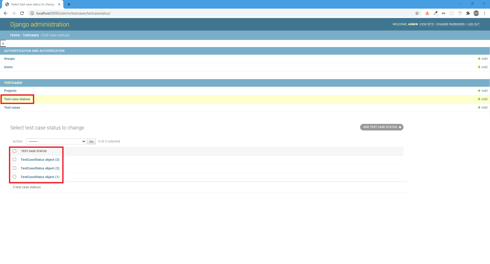

# A simple test cases management tool using Django

## Getting started
```bash
cd simple-django-app
python ./manage.py runserver
```

## Demo

### :rocket: Start app


### :dart: UI

For now we are using Admin from Django to manage Test Case Status and Users
>Code for these 2 screens yet to be done




